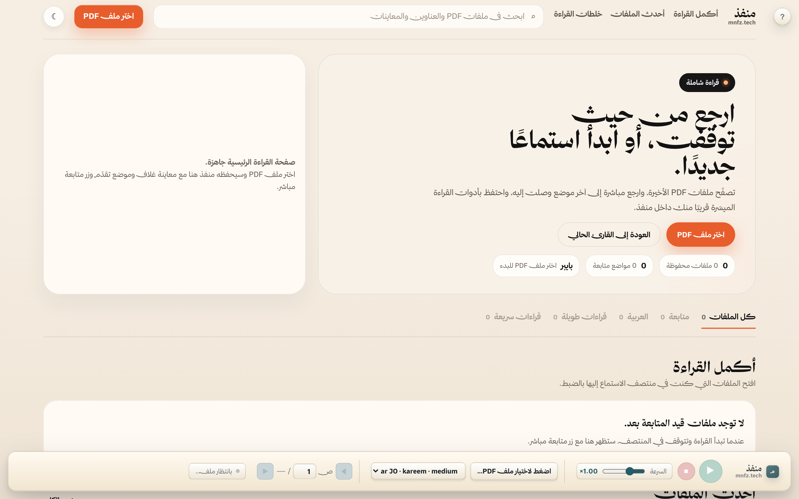
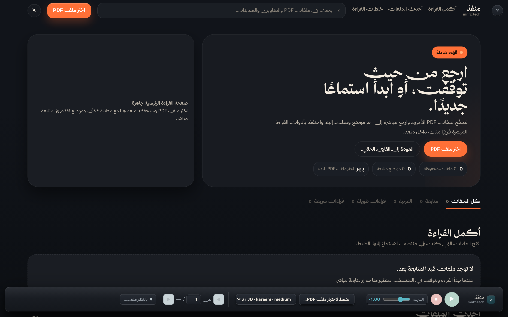
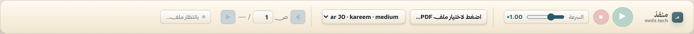
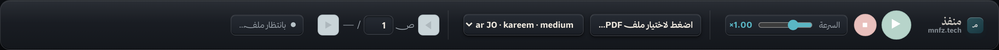
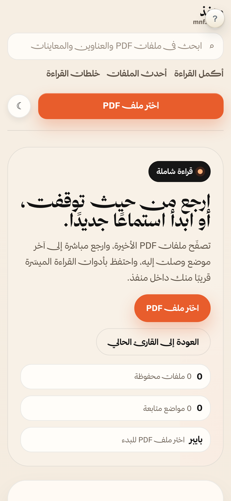
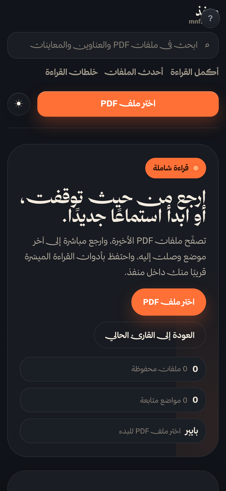

# منفذ (Mnfz) — قارئ PDF ناطق بالعربية

منصة نطق عربية أولاً، تقرأ ملفات PDF بصوت مسموع مع تظليل متزامن للنص، وتدعم عدة محركات صوتية، وتعمل بالكامل على الجهاز محلياً دون حاجة للاتصال السحابي.

مُقدَّم لجائزة **مدى للابتكار** في التكنولوجيا المساعدة.

---

## لقطات الشاشة

### الصفحة الرئيسية
| الوضع الفاتح | الوضع الداكن |
|---|---|
|  |  |

### القارئ (المشغل)
| الوضع الفاتح | الوضع الداكن |
|---|---|
|  |  |

### الجوال
| الوضع الفاتح | الوضع الداكن |
|---|---|
|  |  |

---

## المزايا

- **عربي أولاً — واجهة ثنائية اللغة:** دعم كامل للغة العربية مع إمكانية التبديل للإنجليزية.
- **نطق محلي دون إنترنت:** يستخدم [Piper TTS](https://github.com/rhasspy/piper) لنطق طبيعي سريع بدون اتصال.
- **أصوات عالية الجودة:** Kokoro (8 أصوات) و Azure Speech (10 أصوات، تشمل العربية) اختياري.
- **تسجيل الملاحظات الصوتية:** تسجيل وإعادة تشغيل الملاحظات المنطوقة داخل التطبيق.
- **تظليل متزامن:** عرض PDF.js مع تظليل للنص متزامن مع الصوت على مستوى الكلمة.
- **مكتبة محلية:** متابعة تقدم القراءة عبر مستندات متعددة مع حفظ الموضع.
- **الوضع الداكن:** دعم كامل للوضعين الفاتح والداكن مع حفظ التفضيل.
- **اختصارات لوحة المفاتيح:** مسافة (تشغيل/إيقاف)، الأسهم (تنقل الصفحات)، ومفاتيح A/M/G/F/N.
- **دعم Docker:** ملف `Dockerfile` جاهز للنشر باستخدام الحاويات.
- **دعم الشاشات عالية الدقة:** عرض واضح على شاشات Retina.

---

## التثبيت

1. إنشاء بيئة افتراضية:
   ```bash
   python3 -m venv .venv311
   source .venv311/bin/activate
   ```
2. تثبيت المكتبات:
   ```bash
   pip install -r requirements.txt
   ```
3. تحميل نماذج Piper الصوتية (`en_US-lessac-medium.onnx` مثلاً) داخل مجلد `models/`.
4. للأصوات العربية عبر Azure، عيّن المتغيرات:
   ```bash
   export AZURE_SPEECH_KEY=your_key
   export AZURE_SPEECH_REGION=eastus
   ```
5. فعّل Azure في ملف `.env`:
   ```
   AZURE_TTS_ENABLED=1
   ```

---

## التشغيل

```bash
cd ~/SimpleTTS
source .venv311/bin/activate
uvicorn app:app --host 0.0.0.0 --port 8001
```

افتح `http://localhost:8001` في المتصفح.

---

## Docker

```bash
docker build -t mnfz .
docker run -p 8001:8001 mnfz
```

---

## محركات الصوت

| المحرك | عدد الأصوات | الاتصال |
|---|---|---|
| Piper | 2 (إنجليزية) | بدون إنترنت |
| Kokoro | 8 (متعدد اللغات) | بدون إنترنت |
| Azure | 10 (تشمل العربية) | سحابي (اختياري) |

---

## هيكل المشروع

```
SimpleTTS/
├── app.py              # واجهة FastAPI الخلفية + معالجة PDF والنطق
├── index.html           # واجهة أمامية (Vanilla JS + PDF.js)
├── azure_voice.py       # تكامل Azure TTS
├── kokoro_voice.py      # تكامل Kokoro TTS
├── desktop.py           # تكامل سطح المكتب
├── build_deck.py        # بناء العرض التقديمي
├── capture_screens.py   # أداة التقاط الشاشات
├── DEVLOG.md            # سجل التطوير (28 جلسة)
├── screenshots/         # لقطات الشاشة
├── deck_assets/         # صور العرض التقديمي
├── Dockerfile           # بناء الحاوية
└── requirements.txt     # مكتبات Python المطلوبة
```

---

## حقوق النشر

مستوحى أصلاً من [Gyyyn/OpenWebTTS](https://github.com/Gyyyn/OpenWebTTS). أُعيد بناؤه وتوسيعه بشكل كبير مع واجهة عربية أولاً، ومحركات نطق متعددة، وملاحظات صوتية، ونظام مكتبة، وطلب جائزة مدى للابتكار.

---

# منفذ (Mnfz) — Arabic-First Accessibility TTS

An Arabic-first, local text-to-speech PDF reader built for accessibility and focus. Reads PDFs aloud with real-time page-level highlighting, supports multiple voice engines, and runs entirely on-device — no cloud required.

Applied to the **Mada Innovation Award** for accessibility technology.

## Screenshots

### Home Page
| Light | Dark |
|---|---|
|  |  |

### Reader (Player)
| Light | Dark |
|---|---|
|  |  |

### Mobile
| Light | Dark |
|---|---|
|  |  |

## Features

- **Arabic-First Bilingual UI:** Full RTL support with English toggle — built for Arabic-speaking users first.
- **Local Offline TTS:** Uses [Piper TTS](https://github.com/rhasspy/piper) for fast, natural-sounding offline speech.
- **High-Quality Voices:** Kokoro (8 voices) and optional Azure Speech (10 voices) for more natural pronunciation.
- **Voice Note-Taking:** Record and replay spoken notes directly in the app.
- **Synchronized Highlighting:** PDF.js rendering with audio-timed word-level highlighting.
- **Library Shelf:** Track reading progress across multiple documents with saved positions.
- **Dark Mode:** Full light/dark theme support with persistent preference.
- **Keyboard Shortcuts:** Space (play/pause), ←/→ (page nav), S (stop), A/M/G/F/N for navigation.
- **Docker Support:** `Dockerfile` included for containerized deployment.
- **High-DPI Support:** Crisp text rendering on Retina displays.

## Setup

```bash
python3 -m venv .venv311
source .venv311/bin/activate
pip install -r requirements.txt
```

Download Piper ONNX models (e.g., `en_US-lessac-medium.onnx`) into `models/`. For Azure voices, set `AZURE_SPEECH_KEY` and `AZURE_SPEECH_REGION`, then enable in `.env`:

```
AZURE_TTS_ENABLED=1
```

## Run

```bash
uvicorn app:app --host 0.0.0.0 --port 8001
```

Navigate to `http://localhost:8001`.

## Docker

```bash
docker build -t mnfz .
docker run -p 8001:8001 mnfz
```

## Voice Engines

| Engine | Voices | Network |
|---|---|---|
| Piper | 2 (English) | Offline |
| Kokoro | 8 (multi-language) | Offline |
| Azure | 10 (incl. Arabic) | Cloud (optional) |

## Project Structure

```
SimpleTTS/
├── app.py              # FastAPI backend + PDF/TTS pipeline
├── index.html           # Single-page frontend (Vanilla JS + PDF.js)
├── azure_voice.py       # Azure TTS integration
├── kokoro_voice.py      # Kokoro TTS integration
├── desktop.py           # Desktop integration
├── build_deck.py        # Pitch deck builder
├── capture_screens.py   # Screenshot capture tool
├── DEVLOG.md            # Development log (28 sessions)
├── screenshots/         # App screenshots
├── deck_assets/         # Pitch deck source images
├── Dockerfile           # Container build
└── requirements.txt     # Python dependencies
```

## Credits

Originally inspired by [Gyyyn/OpenWebTTS](https://github.com/Gyyyn/OpenWebTTS). Rebuilt and significantly extended with Arabic-first UX, multi-engine TTS, voice notes, library system, and Mada Innovation Award application.
